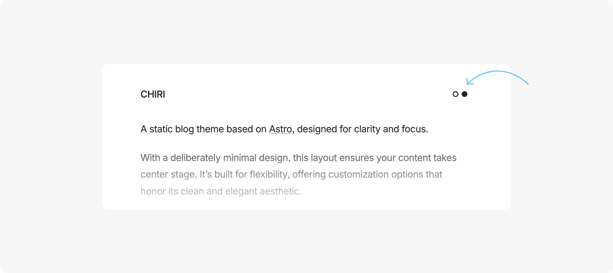
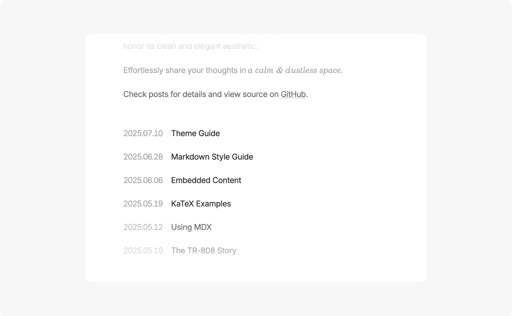
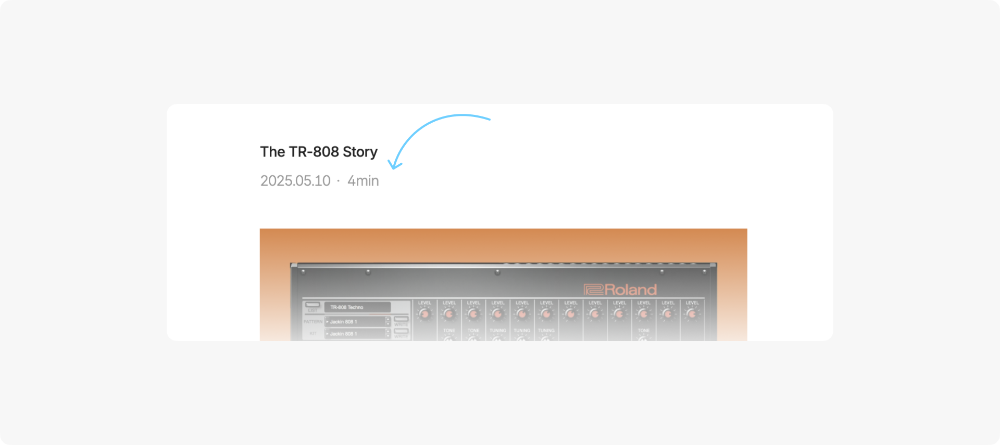
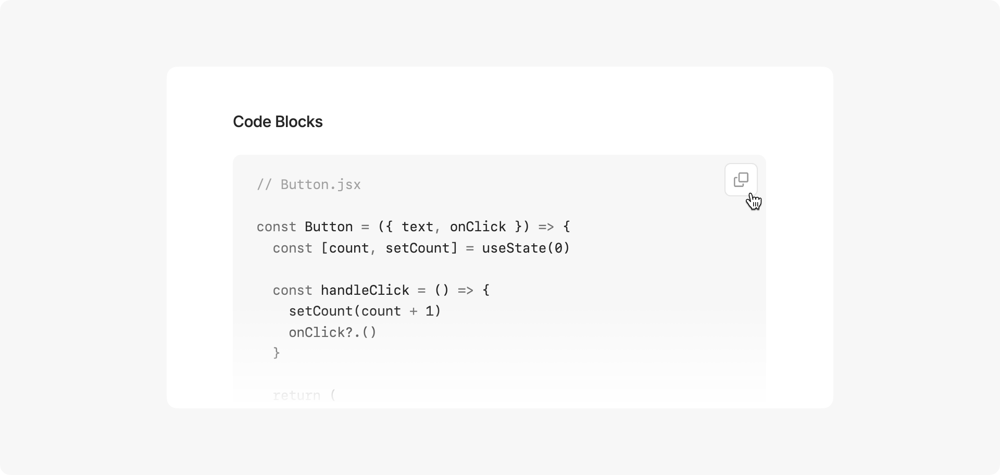

Chiri is a minimal blog theme built with [Astro](https://astro.build), offering customization options while preserving its clean aesthetic.

---

## Basic Commands

- `pnpm new <title>` - Create a new post (use `_title` for drafts)

## Main Files & Directories

- `src/content/paragraphs/[...slug].md` - Add or edit your contents.
- `src/content/posts/[...slug].[md/mdx]` - All blog posts are stored here
- `src/config.ts` - Configure main site info and settings ↓

- Site Info

```ts
site: {
  // Site domain
  website: 'https://pleno.netlify.app/',
  // Site title
  title: 'Pleno',
  // Author name, avatarUrl, and role
  author: {
      name: 'Msafdev',
      avatarUrl: 'http://github.com/msafdev.png',
      role: 'Product Engineer'
  },
  // Site description
  description: 'Minimal blog built by Astro',
  // Default language
  language: 'en-US'
},
```

- General Settings

```ts
general: {
  // Show theme toggle button (uses system theme by default)
  themeToggle: false,
  // Show footer
  footer: true,
  // Enable fade animations
  clientRouter: true
},
```

- Date Settings

```ts
date: {
  // Date format: YYYY-MM-DD, MM-DD-YYYY, DD-MM-YYYY, MONTH DAY YYYY, DAY MONTH YYYY
  dateFormat: 'YYYY-MM-DD',
  // Date separator: . - / (except for MONTH DAY YYYY and DAY MONTH YYYY)
  dateSeparator: '.',
},
```

- Post Settings

```ts
post: {
  // Show reading time in posts
  readingTime: false,
  // Show the table of contents (when there is enough page width)
  toc: true,
  // Enable image viewer
  imageViewer: true,
  // Enable copy button in code blocks
  copyCode: true
  // Enable profile on content (if none, fallbacks to datePub and readingTime)
  authorProfile: true
}
```

## Post Frontmatter

Only `title` and `pubDate` are required fields

```ts
---
title: 'Post Title'
pubDate: '2025-07-10'
---
```

---

## Preview of Some Features

- Theme Toggle



- Date on Left Side



- Table of Contents


- Reading Time



- Copy Code Button



## Components
